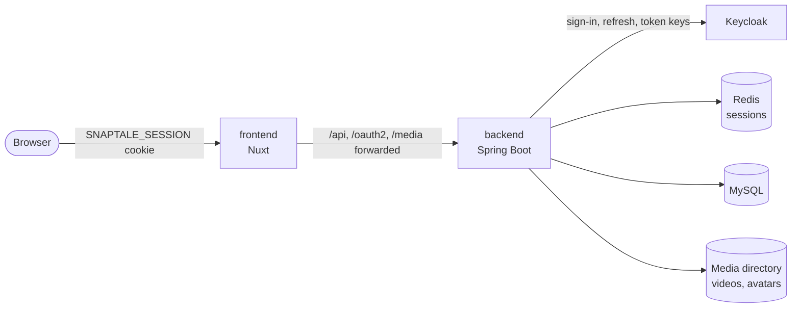

# Architecture

## Two applications

| Application                                     | What it is                                                      |
|-------------------------------------------------|-----------------------------------------------------------------|
| `frontend` ([front-end](../frontend/README.md)) | a Nuxt application: the pages and a server that proxies the API |
| `backend` ([back-end](../backend/README.md))    | a Spring Boot API over MySQL and Redis                          |

The browser talks only to the Nuxt server, which forwards `/api/*`, `/oauth2/*`, `/login/oauth2/*` and `/media/*` to the
back-end. The back-end's cookies are therefore set on the front-end's address and every API call is same-origin.

## Errors and translations

The back-end answers every refusal with a message key, and the front-end renders it from the back-end's catalog: [Error
responses](mechanisms/error-responses.md).
