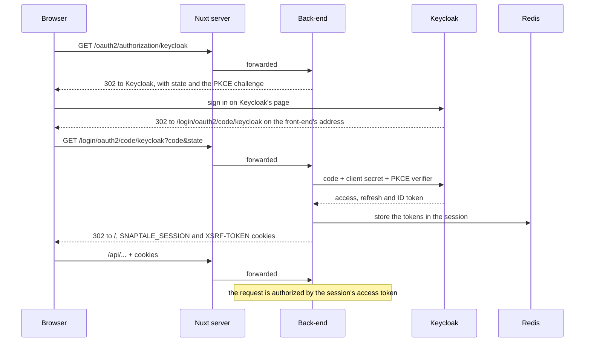

# Authentication

The application never handles a credential. Keycloak (realm `snaptale`) owns every page that touches one: sign-up,
sign-in, email verification, password reset, two-factor authentication and acceptance of the terms of use. The
back-end is a BFF: it signs the user in, keeps the tokens in its session and gives the browser only a session cookie.

## Signing in

1. The front-end sends the browser to `/oauth2/authorization/keycloak`, which the Nuxt server forwards to the back-end.
   `LocalizedAuthorizationRequestResolver` builds the authorization request with PKCE and passes the language from
   the `lang` cookie.
2. Keycloak returns to `/login/oauth2/code/keycloak` on the front-end's address. Spring Security exchanges the code,
   using the confidential client `snaptale-backend` and its secret, and keeps the tokens in the HTTP session.
3. `KeycloakUserService` links the Keycloak identity to a SnapTale account, creating it at the first sign-in, and the
   browser lands on `/`. A sign-in without an email address is refused and lands on `/?login=failed`.

The browser holds only the `SNAPTALE_SESSION` cookie (`HttpOnly`, `SameSite=Lax`, `Secure` in production) and the
`XSRF-TOKEN` cookie.

## Every API request is authorized by a token

For a request to `/api/*` with a session, `SessionAccessTokenFilter` takes the access token from the session,
refreshing it when it is about to expire, and authorizes the request with that token rather than with the session. The
token is verified like any resource server's: the signature against Keycloak's published keys, the issuer, the expiry
and the audience (`snaptale-api`). The request's identity comes from the token, not from the session.

A client without a browser calls the same API with `Authorization: Bearer` and its own Keycloak token: the same checks
apply, and `BearerTokenAccounts` links its account exactly as a sign-in does.

## Sessions and refreshing

The session lives in Redis (Spring Session, namespace `snaptale:session`) and lasts ten hours. Access tokens live five
minutes.

> [!IMPORTANT]
>
> Keycloak rotates refresh tokens: every refresh returns a new one and invalidates the old one, and replaying a spent
> one ends the session. Two requests of one session refreshing at once would therefore sign the user out.

A refresh therefore runs once per refresh token:

- within one instance, `SingleFlightRefreshTokenProvider` lets the first request refresh and hands its result to the
  others;
- across instances, `SharedRefreshes` takes a lock in Redis; the instance holding it refreshes and leaves the new tokens
  in Redis for 30 seconds, where the others pick them up.

When Keycloak refuses a refresh (`invalid_grant`), the session is invalidated and the request goes on anonymous: a
blocked account stops working within minutes.

## Signing out

The front-end posts to `/api/auth/logout`. The back-end ends its session and answers with Keycloak's end-session
address, carrying the ID token; the browser follows it, Keycloak ends its session and returns to the front-end.

## CSRF

The session is a cookie, so every unsafe request needs the CSRF token: the back-end sets it in the `XSRF-TOKEN` cookie
and the front-end sends it back in `X-XSRF-TOKEN`. A request carrying `Authorization` is exempt, because no cookie is
involved.

## Code

| Class                                                                   | Role                                                 |
|-------------------------------------------------------------------------|------------------------------------------------------|
| `security/SecurityConfig`                                               | the filter chain, the client registration, CSRF      |
| `security/LocalizedAuthorizationRequestResolver`                        | PKCE and the language                                |
| `auth/KeycloakUserService`, `auth/BearerTokenAccounts`                  | linking the account at sign-in and for bearer tokens |
| `security/SessionAccessTokenFilter`, `security/SessionAccessTokens`     | a session's request authorized by its token          |
| `security/SingleFlightRefreshTokenProvider`, `security/SharedRefreshes` | one refresh per refresh token                        |
| `security/LogoutUrlResponder`                                           | Keycloak's end-session address                       |
| `user/UserAccounts`                                                     | the SnapTale account linked to a Keycloak identity   |
